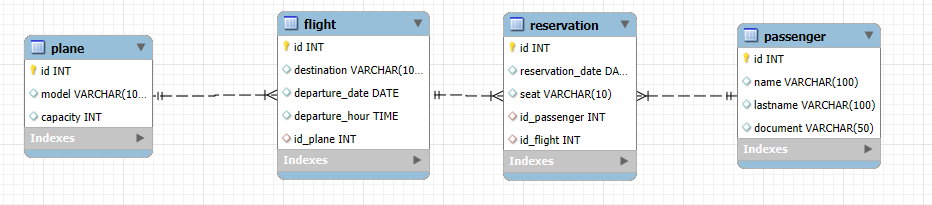

Query para la creacion de la db
use riwi;

CREATE TABLE `flight` (
`id` int NOT NULL AUTO_INCREMENT,
`destination` varchar(100) DEFAULT NULL,
`departure_date` date DEFAULT NULL,
`departure_hour` time DEFAULT NULL,
`id_plane` int DEFAULT NULL,
PRIMARY KEY (`id`),
KEY `id_plane` (`id_plane`),
CONSTRAINT `flight_ibfk_1` FOREIGN KEY (`id_plane`) REFERENCES `plane` (`id`)
) ENGINE=InnoDB AUTO_INCREMENT=5 DEFAULT CHARSET=utf8mb4 COLLATE=utf8mb4_0900_ai_ci;

CREATE TABLE `passenger` (
`id` int NOT NULL AUTO_INCREMENT,
`name` varchar(100) DEFAULT NULL,
`lastname` varchar(100) DEFAULT NULL,
`document` varchar(50) DEFAULT NULL,
PRIMARY KEY (`id`)
) ENGINE=InnoDB AUTO_INCREMENT=4 DEFAULT CHARSET=utf8mb4 COLLATE=utf8mb4_0900_ai_ci;

CREATE TABLE `plane` (
`id` int NOT NULL AUTO_INCREMENT,
`model` varchar(100) DEFAULT NULL,
`capacity` int DEFAULT NULL,
PRIMARY KEY (`id`)
) ENGINE=InnoDB AUTO_INCREMENT=5 DEFAULT CHARSET=utf8mb4 COLLATE=utf8mb4_0900_ai_ci;

CREATE TABLE `reservation` (
`id` int NOT NULL AUTO_INCREMENT,
`reservation_date` date DEFAULT NULL,
`seat` varchar(10) DEFAULT NULL,
`id_passenger` int DEFAULT NULL,
`id_flight` int DEFAULT NULL,
PRIMARY KEY (`id`),
KEY `id_passenger` (`id_passenger`),
KEY `reservation_ibfk_1` (`id_flight`),
CONSTRAINT `reservation_ibfk_1` FOREIGN KEY (`id_flight`) REFERENCES `flight` (`id`) ON DELETE CASCADE,
CONSTRAINT `reservation_ibfk_2` FOREIGN KEY (`id_passenger`) REFERENCES `passenger` (`id`)
) ENGINE=InnoDB AUTO_INCREMENT=2 DEFAULT CHARSET=utf8mb4 COLLATE=utf8mb4_0900_ai_ci;

**imagen de las tablas de la db**

dependencia para la coneccion de la base de datos

<dependency>
            <groupId>com.mysql</groupId>
            <artifactId>mysql-connector-j</artifactId>
            <version>8.3.0</version>
</dependency>